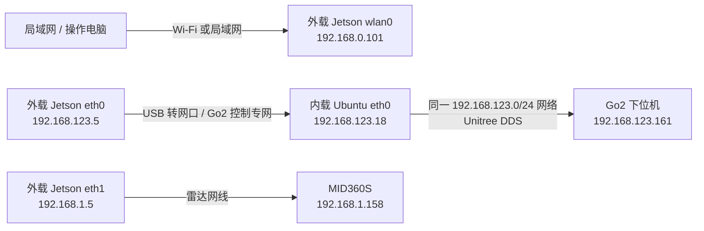
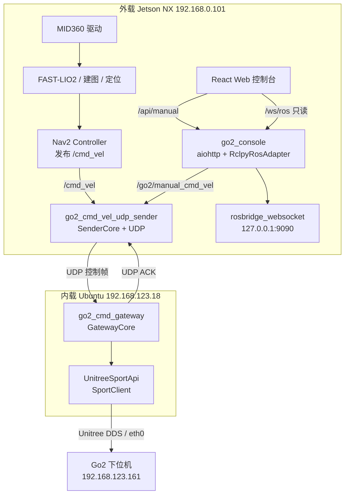
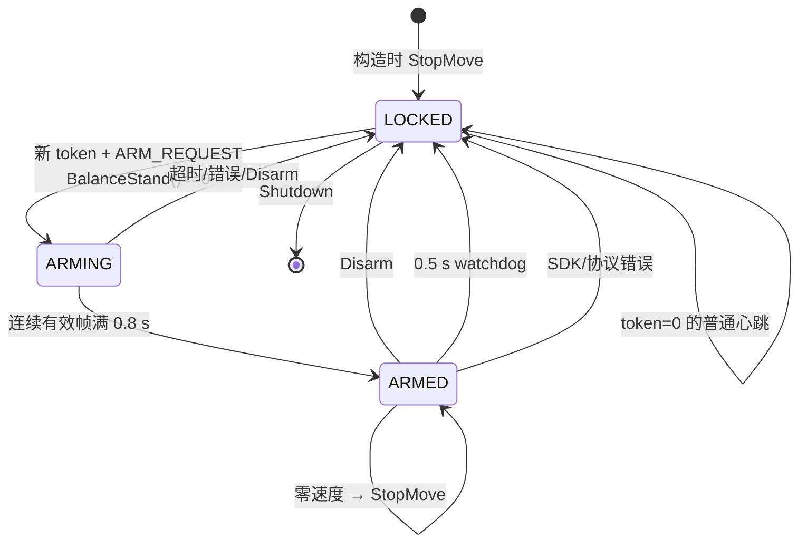

# Jetson NX 到 Go2：外载—内载控制链路架构与接口说明

> 文档版本：2026-07-29  
> 对应仓库：`go2-integrated-web-console`  
> 正常控制路径：外载 Jetson NX → UDP 安全网关 → 内载 Ubuntu 板卡 → Unitree SportClient → Go2 下位机  
> 配套操作文档：[Jetson NX 到 Go2 控制链路部署联调日志](Jetson_NX到Go2_控制链路部署联调日志.md)

## 1. 文档目的

本文解释当前 Go2 导航与运动控制系统的真实实现，包括：

- 每根网线、每个网卡、每个 IP 和端口的职责；
- Nav2 与 Web 控制信号如何从外载 Jetson NX 到达内载板卡；
- 内载板卡如何把速度转换为 Unitree `SportClient` 调用；
- ROS 2 话题、服务、Action、HTTP API、WebSocket 和 UDP 协议；
- 外载和内载两级 fail-closed 状态机；
- 新增代码文件、配置文件、服务文件和测试文件的职责；
- 当前已经验证的部分和内载重新上电后仍需验收的部分。

本文不修改已经验证的 MID360、建图、定位和 Nav2 算法，只说明新增的运动执行链路如何接入。

## 2. 当前系统结论

正常运行时不再让外载 Jetson 直接通过 Unitree DDS 控制 Go2 下位机。当前设计是：

```text
外载 Jetson NX
  ├─ MID360 驱动、建图、定位、Nav2、Web 控制台
  ├─ 接收 Nav2 /cmd_vel 或 Web 手动速度
  └─ go2_cmd_vel_udp_sender
            │
            │ UDP 20 Hz，固定 56 字节控制帧
            │ 192.168.123.5:15001 → 192.168.123.18:15000
            ▼
内载 Ubuntu 板卡
  ├─ go2_cmd_gateway
  ├─ 来源、CRC、序号、会话、Arm 令牌、限速、watchdog
  └─ Unitree 原生 SportClient
            │
            │ DDS，经内载 eth0
            ▼
Go2 下位机 192.168.123.161
  └─ BalanceStand / Move / StopMove
```

这样分工的原因：

- 外载 Jetson NX 计算能力更强，保留雷达、建图、定位、Nav2 和 Web；
- 内载板卡靠近 Go2 原生控制网络，继续使用官方 SDK/DDS；
- 两板之间只传递经过约束的速度和状态，不传点云、地图等大数据；
- 内载即使与外载失联，也能在 0.5 秒 watchdog 内独立停车并锁定；
- 网络恢复后不会自动恢复运动，必须重新取得控制权并 Arm。

## 3. 物理连接与网络分层

### 3.1 物理拓扑



### 3.2 固定地址

| 设备 | 接口 | 地址 | 网关 | 作用 |
|---|---|---:|---|---|
| 外载 Jetson NX | `wlan0` | `192.168.0.101/24` | 局域网网关 | SSH、Web、默认路由 |
| 外载 Jetson NX | `eth0` | `192.168.123.5/24` | 无 | Go2 控制专网，只连接内载 |
| 外载 Jetson NX | `eth1` | `192.168.1.5/24` | 无 | MID360S 雷达专网 |
| 内载 Ubuntu 板卡 | `eth0` | `192.168.123.18/24` | 无需默认网关 | 接收 UDP 并运行 SportClient |
| Go2 下位机 | 原生控制网 | `192.168.123.161/24` | 不适用 | Unitree DDS / Sport API |
| MID360S | 雷达网口 | `192.168.1.158/24` | 不适用 | 点云与 IMU |

必须明确：

- `192.168.123.18` 是内载 Ubuntu 计算机；
- `192.168.123.161` 是 Go2 下位机；
- `eth0` 只属于 Go2 控制网络；
- `eth1` 只属于 MID360 雷达网络；
- `eth0` 和 `eth1` 都不得配置默认网关；
- 外载默认路由只走 `wlan0`。

### 3.3 预期路由

```text
外载到 192.168.123.18  → eth0，源地址 192.168.123.5
外载到 192.168.123.161 → eth0，源地址 192.168.123.5
外载到 192.168.1.158   → eth1，源地址 192.168.1.5
外载 default           → wlan0
内载到 192.168.123.161 → eth0，源地址 192.168.123.18
```

当内载断电或 USB 转网口没有载波时，外载系统可能临时使用 `wlan0` 默认路由查询
`192.168.123.18` 和 `192.168.123.161`。这时不能进行控制链路验收；链路恢复后必须重新执行
`ip route get`，确认路由回到 `eth0`。

### 3.4 端口

| 协议 | 源 | 目标 | 方向 | 用途 |
|---|---|---|---|---|
| UDP | `192.168.123.5:15001` | `192.168.123.18:15000` | 外载 → 内载 | 20 Hz 控制帧 |
| UDP | `192.168.123.18:15000` | `192.168.123.5:15001` | 内载 → 外载 | ACK 与网关状态 |
| TCP/HTTP | 操作电脑 | `192.168.0.101:8080` | 局域网 → 外载 | Web 控制台 |
| TCP/WebSocket | Web 后端 | `127.0.0.1:9090` | 外载回环 | rosbridge，只读可视化 |
| DDS | 内载 `eth0` | Go2 `192.168.123.161` | 双向 | Unitree Sport API 与状态 |

`9090` 只能监听 `127.0.0.1`。局域网浏览器不应直接访问它。

## 4. 软件进程架构



### 4.1 外载进程

| 进程 / 节点 | 运行位置 | 主要职责 |
|---|---|---|
| Nav2 | 外载 | 根据地图、定位和障碍物生成 `/cmd_vel` |
| `go2_cmd_vel_udp_sender` | 外载 | 在 Nav2 与手动速度之间选择；做一级限速、超时、定位保护；封装 UDP |
| `go2_console` | 外载 | 登录、会话、CSRF、单控制权、Arm/Disarm、导航 API、手动控制互锁 |
| `rosbridge_websocket` | 外载回环 | 向后端提供 ROS 可视化数据，不直接暴露给局域网 |
| React Web | 浏览器 | 地图、雷达、TF、导航目标、状态和手动按钮 |

### 4.2 内载进程

| 进程 | 运行位置 | 主要职责 |
|---|---|---|
| `go2_cmd_gateway` | 内载 | 绑定 UDP、限制来源、解析协议、运行内载状态机 |
| `GatewayCore` | 内载进程内部 | Arm、watchdog、二次限速、令牌撤销、SDK 错误处理 |
| `UnitreeSportApi` | 内载进程内部 | 初始化 DDS 通道，调用 `SportClient` |

### 4.3 systemd 服务

| 服务 | 设备 | 启动程序 |
|---|---|---|
| `go2-console.service` | 外载 | `ros2 run go2_control_gateway go2_console` |
| `go2-console-rosbridge.service` | 外载 | `ros2 run rosbridge_server rosbridge_websocket` |
| `go2-cmd-gateway.service` | 内载 | `/usr/local/bin/go2_cmd_gateway` |

UDP sender 当前由导航启动脚本 `src/Go2_bringup/run_nav2.sh` 启动，不是单独的 systemd 服务。

## 5. 正向控制数据流

## 5.1 Nav2 自动导航速度

1. MID360S 经外载 `eth1` 提供点云和 IMU。
2. 建图/定位链路产生地图、定位、TF、`/scan` 和 `/map_to_odom`。
3. Nav2 根据目标、地图和局部障碍计算 `geometry_msgs/msg/Twist`。
4. Nav2 在 `/cmd_vel` 发布：
   - `linear.x` → `vx`
   - `linear.y` → `vy`
   - `angular.z` → `vyaw`
5. `go2_cmd_vel_udp_sender` 订阅 `/cmd_vel`。
6. sender 读取 `/navigate_to_pose/_action/status`：
   - `ACCEPTED`、`EXECUTING`、`CANCELING` 视为 Nav2 活跃；
   - Nav2 活跃时选择 `/cmd_vel`，拒绝 Web 手动速度。
7. sender 应用定位保护、命令超时、死区、角速度滤波和一级硬限速。
8. sender 每 50 ms 发送一个 56 字节控制帧。
9. 内载网关验证帧后调用 `SportClient.Move(vx, vy, vyaw)`。

## 5.2 Web 手动速度

1. 浏览器登录 `http://192.168.0.101:8080`。
2. 浏览器取得单操作员控制租约。
3. 操作员确认现场安全并点击 Arm。
4. 后端调用 ROS 服务 `/go2_cmd_vel_gateway/arm`。
5. sender 生成新的 64 位 `arm_token`，持续发送 `ARM_REQUEST`。
6. 内载先调用 `BalanceStand()`，进入 `ARMING`。
7. 连续有效帧满 0.8 秒后进入 `ARMED`。
8. 页面按住方向按钮时，每 100 ms 调用 `/api/manual`。
9. 后端把固定字段的 `Twist` 发布到 `/go2/manual_cmd_vel`。
10. sender 仅在 Nav2 不活跃时选择手动速度。
11. 松开按钮、失焦、隐藏页面、WebSocket 断开或租约超时后，手动速度归零。
12. 内载收到零速度后调用 `StopMove()`，保持 `ARMED`；显式 Disarm 后回到 `LOCKED`。

## 5.3 Web 发送导航目标

Web 不直接向 rosbridge 发布 Action。固定流程是：

```text
React
  → POST /api/navigation/goal
  → go2_console
  → RclpyRosAdapter
  → ActionClient<NavigateToPose>
  → /navigate_to_pose
```

多点导航：

- 新版 Nav2：`NavigateThroughPoses`，Action 名 `/navigate_through_poses`；
- ROS 2 Foxy：若不存在 `NavigateThroughPoses`，自动使用 `FollowWaypoints`，
  Action 名 `/follow_waypoints`。

初始位姿：

```text
POST /api/localization/initialpose
  → geometry_msgs/PoseWithCovarianceStamped
  → /initialpose
```

## 6. 反向状态流

### 6.1 UDP ACK

1. 内载处理每个有效控制帧。
2. 内载返回 56 字节 ACK，携带：
   - `session_id`
   - 已处理 `sequence`
   - 当前 `arm_token`
   - 网关状态
   - SDK 返回码
   - 故障原因
3. 外载只接受来源为 `192.168.123.18:15000` 的 ACK。
4. ACK 必须匹配当前会话、序号和令牌。
5. sender 将状态发布到 `/go2_cmd_vel_gateway/status`。

状态 JSON 示例：

```json
{
  "gateway_link": "online",
  "armed": true,
  "nav_active": false,
  "last_ack_age_sec": 0.041,
  "send_hz": 20.0
}
```

### 6.2 Web 状态

`go2_console` 汇总：

| 字段 | 主要来源 |
|---|---|
| `gateway_link` | `/go2_cmd_vel_gateway/status` |
| `armed` | `/go2_cmd_vel_gateway/status` |
| `nav2_status` | `/navigate_to_pose/_action/status` |
| `odometry` | `/odom` |
| `velocity` | `/odom` 或 `/sportmodestate` |
| `battery_percent` | `/lowstate` |
| `motion_mode` | `/sportmodestate` |
| `control_lease_held` | Web 后端控制租约 |
| `nav_active` | Web 后端 Nav2 互锁状态 |
| `manual_command_active` | Web 后端手动命令 watchdog |

浏览器通过 `/ws/state` 每 0.25 秒接收状态。

注意：电量和运动模式需要外载 ROS 图中确实存在 `/lowstate` 和 `/sportmodestate`。
如果没有状态转发，这两个字段可能显示为空或未知，但不会绕过 Arm、UDP ACK 和 watchdog。

## 7. ROS 2 接口

### 7.1 外载 sender 接口

| 类型 | 名称 | 消息类型 | 方向 | 作用 |
|---|---|---|---|---|
| Topic | `/cmd_vel` | `geometry_msgs/msg/Twist` | 订阅 | Nav2 速度 |
| Topic | `/go2/manual_cmd_vel` | `geometry_msgs/msg/Twist` | 订阅 | Web/CLI 手动速度 |
| Topic | `/map_to_odom` | `nav_msgs/msg/Odometry` | 订阅 | 定位新鲜度与跳变保护 |
| Topic | `/navigate_to_pose/_action/status` | `action_msgs/msg/GoalStatusArray` | 订阅 | Nav2/手动互锁 |
| Topic | `/go2_cmd_vel_gateway/status` | `std_msgs/msg/String` | 发布 | JSON 网关状态 |
| Service | `/go2_cmd_vel_gateway/arm` | `std_srvs/srv/SetBool` | 服务端 | `true` Arm，`false` Disarm |

### 7.2 Web ROS adapter 接口

| 类型 | 名称 | 类型 | 作用 |
|---|---|---|---|
| Publisher | `/go2/manual_cmd_vel` | `geometry_msgs/msg/Twist` | 手动速度 |
| Client | `/go2_cmd_vel_gateway/arm` | `std_srvs/srv/SetBool` | Arm/Disarm |
| Action Client | `/navigate_to_pose` | `nav2_msgs/action/NavigateToPose` | 单点导航 |
| Action Client | `/navigate_through_poses` | `nav2_msgs/action/NavigateThroughPoses` | 新版多点导航 |
| Action Client | `/follow_waypoints` | `nav2_msgs/action/FollowWaypoints` | Foxy 多点导航 |
| Service Client | `/navigate_to_pose/_action/cancel_goal` | `action_msgs/srv/CancelGoal` | 取消导航 |
| Publisher | `/initialpose` | `geometry_msgs/msg/PoseWithCovarianceStamped` | 设置初始位姿 |
| Subscriber | `/odom` | `nav_msgs/msg/Odometry` | 位置与速度 |
| Subscriber | `/lowstate` | `unitree_go/msg/LowState` | 电量 |
| Subscriber | `/sportmodestate` | `unitree_go/msg/SportModeState` | 运动模式与速度 |

### 7.3 Nav2 状态值

| 数值 | 名称 | 手动控制 |
|---:|---|---|
| 0 | `UNKNOWN` | 由最终状态判断 |
| 1 | `ACCEPTED` | 禁止 |
| 2 | `EXECUTING` | 禁止 |
| 3 | `CANCELING` | 禁止 |
| 4 | `SUCCEEDED` | 可在回到空闲后启用 |
| 5 | `CANCELED` | 可在回到空闲后启用 |
| 6 | `ABORTED` | 可在回到空闲后启用 |
| 无活动目标 | `IDLE` | 允许，但仍需控制权和 Arm |

## 8. Web HTTP 与 WebSocket 接口

所有改变状态的 HTTP 请求都需要：

- 已登录的 HttpOnly Cookie；
- `X-CSRF-Token`；
- 同源请求；
- 除 Disarm 外，运动相关操作通常还需要当前控制租约。

### 8.1 HTTP API

| 方法 | 路径 | 请求体 | 作用 |
|---|---|---|---|
| POST | `/api/login` | `{"username":"operator","password":"..."}` | 登录并返回 CSRF token |
| POST | `/api/logout` | 无 | 登出、释放控制权、归零 |
| GET | `/api/state` | 无 | 获取状态 |
| POST | `/api/control/acquire` | 无 | 取得单操作员控制权 |
| POST | `/api/control/release` | 无 | 释放控制权并归零 |
| POST | `/api/arm` | 无 | 请求 Arm |
| POST | `/api/disarm` | 无 | 立即归零并请求 Disarm |
| POST | `/api/manual` | `{"vx":0.1,"vy":0,"vyaw":0}` | 手动速度 |
| POST | `/api/navigation/cancel` | 无 | 取消 Nav2 |
| POST | `/api/navigation/goal` | `{"x":1.0,"y":0.5,"yaw":0.0}` | 单点导航 |
| POST | `/api/navigation/waypoints` | `{"poses":[...]}` | 1～100 个导航点 |
| POST | `/api/localization/initialpose` | `{"x":0,"y":0,"yaw":0}` | 初始位姿 |

位姿约束：

- `x`、`y`、`yaw` 必须为有限数；
- `|x|`、`|y|` 不得超过 `10000`；
- `yaw ∈ [-π, π]`。

### 8.2 WebSocket

| 路径 | 方向 | 作用 |
|---|---|---|
| `/ws/state` | 后端 → 浏览器 | 4 Hz 状态推送 |
| `/ws/state` | 浏览器 → 后端 | `{"type":"heartbeat"}`，保持控制租约 |
| `/ws/ros` | 双向代理 | 只允许白名单 topic 的 subscribe/unsubscribe |

控制租约参数：

- 租约超时：2.0 秒；
- 页面持有租约时每 0.5 秒发送 heartbeat；
- 手动命令超时：0.2 秒；
- 会话空闲超时：1800 秒；
- 会话绝对超时：43200 秒。

### 8.3 `/ws/ros` 白名单

允许订阅：

```text
/map
/scan
/tf
/tf_static
/plan
/local_plan
/global_costmap/costmap
/local_costmap/costmap
/global_costmap/published_footprint
/local_costmap/published_footprint
/cloud_registered
/odom
/rosout
/map/topology
/navigate_to_pose/_action/status
/navigate_through_poses/_action/status
/follow_waypoints/_action/status
```

拒绝：

- `publish`
- service 调用
- Action 调用
- 未在白名单中的 topic
- 动态指定运动 topic

因此浏览器不能绕过后端直接向 `/cmd_vel` 发布。

## 9. 外载 UDP sender

### 9.1 网络参数

配置文件：`config/udp_sender.yaml`

```yaml
local_ip: "192.168.123.5"
local_port: 15001
remote_ip: "192.168.123.18"
remote_port: 15000
send_hz: 20.0
```

socket 显式绑定 `192.168.123.5:15001`。即使系统存在其他网卡，UDP 源地址也必须是
`192.168.123.5`。

### 9.2 速度选择优先级

```text
未 ARMED                    → 发送零速度
定位无效或定位超时          → 发送零速度
检测到大幅定位校正暂停期    → 发送零速度
Nav2 活跃                  → 选择 /cmd_vel
Nav2 不活跃                → 选择 /go2/manual_cmd_vel
对应命令超时                → 发送零速度
```

### 9.3 sender 参数

| 参数 | 值 | 作用 |
|---|---:|---|
| `max_vx` | `0.6 m/s` | 一级前后速度限制 |
| `max_vy` | `0.0 m/s` | 禁止侧移进入底盘 |
| `max_vyaw` | `1.4 rad/s` | 一级转向限制 |
| `velocity_deadband` | `0.03` | 小速度归零 |
| `vyaw_smooth_alpha` | `0.35` | 角速度一阶平滑 |
| `nav_cmd_timeout_sec` | `0.6 s` | Nav2 速度超时 |
| `manual_cmd_timeout_sec` | `0.2 s` | 手动速度超时 |
| `ack_timeout_sec` | `0.5 s` | ACK 失联超时 |
| `arm_timeout_sec` | `1.0 s` | Arm 确认超时 |
| `localization_timeout_sec` | `1.5 s` | 定位新鲜度 |
| `correction_pause_sec` | `0.8 s` | 大幅定位校正后的暂停 |
| `correction_pause_delta_xy` | `0.5 m` | 位置跳变阈值 |
| `correction_pause_delta_yaw` | `0.7 rad` | 航向跳变阈值 |

## 10. UDP 线协议

协议实现：

- Python：`go2_control_gateway/protocol.py`
- C++：`internal_gateway/include/go2_gateway/protocol.hpp`

共同属性：

- magic：`0x47324757`，ASCII `G2GW`；
- version：`1`；
- 网络字节序：big-endian；
- 控制帧：固定 56 字节；
- ACK：固定 56 字节；
- CRC：IEEE CRC32，覆盖前 52 字节；
- 不允许可变长度或未定义扩展字段。

### 10.1 控制帧

| 偏移 | 长度 | 类型 | 字段 | 说明 |
|---:|---:|---|---|---|
| 0 | 4 | `uint32` | `magic` | `0x47324757` |
| 4 | 2 | `uint16` | `version` | `1` |
| 6 | 2 | `uint16` | `packet_type` | 控制帧为 `1` |
| 8 | 2 | `uint16` | `declared_length` | `56` |
| 10 | 2 | `uint16` | `reserved` | 必须为 `0` |
| 12 | 8 | `uint64` | `session_id` | sender 进程会话，非零 |
| 20 | 8 | `uint64` | `sequence` | 单调递增，非零 |
| 28 | 8 | `uint64` | `arm_token` | Arm 令牌；LOCKED 心跳可为 0 |
| 36 | 4 | `uint32` | `flags` | 0、Arm 或 Disarm |
| 40 | 4 | `float32` | `vx` | m/s |
| 44 | 4 | `float32` | `vy` | m/s，最终被限制为 0 |
| 48 | 4 | `float32` | `vyaw` | rad/s |
| 52 | 4 | `uint32` | `crc32` | 前 52 字节 CRC |

控制标志：

| 值 | 名称 | 作用 |
|---:|---|---|
| `0` | `NONE` | 心跳或速度 |
| `1` | `ARM_REQUEST` | 请求/保持 Arm 过程 |
| `2` | `DISARM` | 显式锁定 |

Arm 与 Disarm 位不能同时出现。

### 10.2 ACK

| 偏移 | 长度 | 类型 | 字段 | 说明 |
|---:|---:|---|---|---|
| 0 | 4 | `uint32` | `magic` | `0x47324757` |
| 4 | 2 | `uint16` | `version` | `1` |
| 6 | 2 | `uint16` | `packet_type` | ACK 为 `2` |
| 8 | 2 | `uint16` | `declared_length` | `56` |
| 10 | 2 | `uint16` | `reserved` | 必须为 `0` |
| 12 | 8 | `uint64` | `session_id` | 回显会话 |
| 20 | 8 | `uint64` | `sequence` | 已处理序号 |
| 28 | 8 | `uint64` | `arm_token` | 回显令牌 |
| 36 | 4 | `uint32` | `state` | 网关状态 |
| 40 | 4 | `int32` | `sdk_code` | Unitree SDK 返回码 |
| 44 | 4 | `uint32` | `fault` | 故障原因 |
| 48 | 4 | `uint32` | `flags` | 当前保留为 0 |
| 52 | 4 | `uint32` | `crc32` | 前 52 字节 CRC |

网关状态：

| 值 | 状态 |
|---:|---|
| 0 | `LOCKED` |
| 1 | `ARMING` |
| 2 | `ARMED` |
| 3 | `FAULT`，协议保留状态 |

故障原因：

| 值 | 名称 | 说明 |
|---:|---|---|
| 0 | `NONE` | 无故障 |
| 1 | `WATCHDOG` | 有效帧超时 |
| 2 | `PROTOCOL` | 会话/协议故障 |
| 3 | `SDK` | SportClient 返回非零 |
| 4 | `EXPLICIT_DISARM` | 人工 Disarm |
| 5 | `SHUTDOWN` | 进程退出 |

## 11. 内载验证顺序

内载 `main.cpp` 的处理顺序：

1. 使用参数创建 Sport API；
2. `GatewayCore` 构造时立即调用一次 `StopMove()`；
3. 创建 UDP socket；
4. bind `192.168.123.18:15000`；
5. 只接受来源 IP `192.168.123.5`；
6. 解码 56 字节控制帧；
7. 检查长度、magic、版本、类型、reserved、CRC；
8. 检查有限浮点数、非零 session/sequence、合法 flag；
9. 检查会话、递增 sequence 和 Arm token；
10. 运行 `GatewayCore` 状态机；
11. 必要时调用 Unitree API；
12. 返回 ACK；
13. 每 10 ms tick 一次 watchdog；
14. SIGINT/SIGTERM 时 `StopMove()` 并返回 shutdown ACK。

以下包不会刷新 watchdog：

- 错误来源 IP；
- 错误长度；
- 错 magic；
- 错版本；
- 错 CRC；
- NaN/Inf；
- 非递增 sequence；
- 错误或已撤销 token；
- 冲突或未知 flags。

## 12. 内载 fail-closed 状态机



### 12.1 硬限速

内载独立于外载再次限制：

```text
vx   ∈ [-0.6, 0.6] m/s
vy   = 0.0 m/s
vyaw ∈ [-1.4, 1.4] rad/s
```

即使外载软件配置错误，内载也不会把更大的速度传给 `SportClient`。

### 12.2 令牌撤销

- 每次 Arm 使用一个新的非零 64 位 token；
- Disarm、watchdog、SDK 错误、协议故障和 shutdown 都撤销当前 token；
- 内载保存最近 256 个已撤销 token；
- 旧 token 不能再次触发 `BalanceStand`；
- 网络恢复或进程重连不会自动恢复 ARMED。

## 13. Unitree SportClient 调用

文件：`internal_gateway/src/unitree_sport_api.cpp`

初始化：

```cpp
unitree::robot::ChannelFactory::Instance()->Init(0, interface_name);
client_.SetTimeout(3.0F);
client_.Init();
```

systemd 向程序传递：

```text
--interface eth0
```

API 映射：

| 网关事件 | SportClient 调用 |
|---|---|
| 进程启动 | `StopMove()` |
| 新 Arm | `BalanceStand()` |
| ARMED 且非零速度 | `Move(vx, vy, vyaw)` |
| ARMED 且速度归零 | `StopMove()` |
| Disarm | `StopMove()` |
| watchdog | `StopMove()` |
| SDK/协议故障 | `StopMove()` |
| SIGINT/SIGTERM | `StopMove()` |

重要说明：`192.168.123.161` 没有作为命令行参数直接传给 `SportClient`。Unitree SDK 通过
`ChannelFactory::Init(0, "eth0")` 在内载 `eth0` 上初始化 DDS，并在
`192.168.123.0/24` 控制网络中发现 Go2 下位机。因此：

- 内载 `eth0` 和 DDS 网卡选择比“应用层填写下位机 IP”更关键；
- `/home/nvidia/unitree_ros2/setup.sh` 或内载 SDK 环境中网卡必须是 `eth0`；
- 如果 DDS 错绑 `eth1` 或 Wi-Fi，即使能 ping 下位机，`SportClient` 也可能不能工作。

## 14. 双端超时矩阵

| 层级 | 条件 | 时间 | 结果 |
|---|---|---:|---|
| 浏览器 | 手动按钮停止刷新 | 0.2 s | 后端手动速度归零 |
| 浏览器 | 控制租约无 heartbeat | 2.0 s | 释放租约、速度归零 |
| sender | 手动速度陈旧 | 0.2 s | 发送零速度 |
| sender | Nav2 `/cmd_vel` 陈旧 | 0.6 s | 发送零速度 |
| sender | 定位陈旧 | 1.5 s | 发送零速度 |
| sender | 定位大幅校正 | 0.8 s | 暂停运动 |
| sender | Arm 未确认 | 1.0 s | 发送 Disarm、撤销 token |
| sender | ACK 失联 | 0.5 s | 本地 fail-closed |
| 内载 | 有效控制帧失联 | 0.5 s | `StopMove`、`LOCKED` |
| Unitree client | SDK 调用超时 | 3.0 s | 返回错误，网关锁定 |

最快的保护在内载，不依赖浏览器或外载进程继续运行。

## 15. 正常与诊断路径

### 15.1 正常路径

```bash
GO2_CONTROL_BACKEND=udp
```

`run_nav2.sh` 启动：

```bash
ros2 launch go2_control_gateway udp_sender.launch.py
```

### 15.2 旧诊断路径

```bash
GO2_CONTROL_BACKEND=direct-dds
```

这会启动旧的：

```bash
ros2 launch go2_nav2 cmd_vel_bridge.launch.py
```

旧路径保留用于诊断，不是交付主路径。切换前必须先 Disarm，且不得同时运行两个速度执行器。

## 16. 新增代码与文件

相对原导航仓库，本次新增了整个 `Go2_control_gateway` 包，并修改/新增了少量 bringup 文档与脚本。

### 16.1 Python 核心

| 文件 | 职责 |
|---|---|
| `go2_control_gateway/protocol.py` | 56 字节控制帧/ACK、CRC、枚举 |
| `go2_control_gateway/sender_core.py` | 外载状态机、命令选择、定位保护、限速 |
| `go2_control_gateway/udp_sender_node.py` | ROS 订阅/服务、UDP socket、ACK 接收、状态发布 |
| `go2_control_gateway/console_core.py` | 登录会话、CSRF 关联数据、单控制租约、手动互锁 |
| `go2_control_gateway/console_server.py` | aiohttp API、WebSocket、静态资源、watchdog |
| `go2_control_gateway/ros_adapter.py` | 固定 ROS publisher/service/action client 和状态订阅 |
| `go2_control_gateway/readonly_rosbridge.py` | rosbridge 只读白名单 |
| `go2_control_gateway/set_console_password.py` | 生成 scrypt 密码哈希 |
| `go2_control_gateway/__init__.py` | Python 包入口 |

### 16.2 内载 C++ 网关

| 文件 | 职责 |
|---|---|
| `internal_gateway/include/go2_gateway/protocol.hpp` | 与 Python 对齐的 C++ 协议 |
| `internal_gateway/include/go2_gateway/gateway_core.hpp` | 内载配置与状态机声明 |
| `internal_gateway/include/go2_gateway/sport_api.hpp` | Unitree API 抽象接口 |
| `internal_gateway/src/main.cpp` | UDP 主循环、来源 IP、signal、ACK |
| `internal_gateway/src/gateway_core.cpp` | LOCKED/ARMING/ARMED、watchdog、限速 |
| `internal_gateway/src/unitree_sport_api.cpp` | 官方 `SportClient` 实现 |
| `internal_gateway/src/dry_run_sport_api.cpp` | 无运动测试实现 |
| `internal_gateway/CMakeLists.txt` | C++17、SDK 链接、测试目标 |

### 16.3 配置、启动与部署

| 文件 | 职责 |
|---|---|
| `config/udp_sender.yaml` | 外载 IP、端口、话题、限速和超时 |
| `config/internal_gateway.env` | 内载 bind、allowed IP、接口 |
| `config/console.yaml` | Web bind、会话和控制租约 |
| `launch/udp_sender.launch.py` | ROS 2 sender launch |
| `systemd/go2-cmd-gateway.service` | 内载守护进程 |
| `systemd/go2-console.service` | 外载 Web 后端 |
| `systemd/go2-console-rosbridge.service` | 回环 rosbridge |
| `scripts/deploy_internal_gateway.sh` | 内载 SDK 构建与安装 |
| `scripts/install_external_services.sh` | 前端、ROS 包和外载服务安装 |
| `scripts/build_frontend.sh` | npm 测试与生产构建 |
| `setup.py` | ROS 2 Python 可执行入口 |
| `package.xml` | ROS 2 依赖 |
| `setup.cfg` | ament Python 配置 |
| `resource/go2_control_gateway` | ament 索引 |

### 16.4 Web 融合代码

前端目录 `frontend/` 基于 `lijinghai/ljh_robot_ros2_web` 融合，第三方说明见
`THIRD_PARTY_NOTICES.md`。

与安全控制直接相关的文件：

| 文件 | 职责 |
|---|---|
| `frontend/src/api/consoleClient.ts` | 固定同源 API 客户端、CSRF、WebSocket URL |
| `frontend/src/components/Go2Login.tsx` | 登录页面 |
| `frontend/src/components/Go2ControlPanel.tsx` | 状态、控制权、Arm/Disarm、按住运动 |
| `frontend/src/components/controlPolicy.ts` | Nav2 活跃判断、方向到速度映射 |
| `frontend/src/App.tsx` | 登录态与原导航 Web 的整合 |
| `frontend/src/App.css` | 融合布局 |
| `frontend/src/components/Go2ControlPanel.css` | 控制面板样式 |
| `frontend/src/utils/RosbridgeConnection.ts` | 使用同源 `/ws/ros` |

可视化与导航相关目录：

```text
frontend/src/components/
  MapView.tsx
  MapEditor.tsx
  NavigationPanel.tsx
  LayerSettingsPanel.tsx
  TaskManagementPanel.tsx
  SystemLogPanel.tsx
  layers/

frontend/src/hooks/
  useConnectionInit.ts
  useInitialization.ts
  useNavigationMode.ts
  useRelocalizeMode.ts
  useViewMode.ts

frontend/src/utils/
  MapManager.ts
  CommandManager.ts
  tf2js.ts
  topicAutoAdapter.ts
  mapImporter.ts
  mapExporter.ts
```

生产构建输出到：

```text
go2_control_gateway/web/index.html
go2_control_gateway/web/assets/*.js
go2_control_gateway/web/assets/*.css
```

### 16.5 测试

Python：

| 文件 | 覆盖 |
|---|---|
| `test/test_protocol.py` | 协议、CRC、长度、非法值 |
| `test/test_sender_core.py` | 外载 Arm、超时、限速、定位保护 |
| `test/test_udp_sender_adapter.py` | UDP bind、ACK 来源、shutdown |
| `test/test_console_core.py` | 登录、租约、Nav2 互锁、手动超时 |
| `test/test_console_http.py` | HTTP、CSRF、Cookie、WebSocket |
| `test/test_readonly_rosbridge.py` | rosbridge allowlist |
| `test/test_ros_adapter_compat.py` | Foxy/新版多点 Action |
| `test/test_deployment_contract.py` | systemd 与部署约束 |
| `test/test_web_contract.py` | Web 安全契约 |
| `test/test_documentation_contract.py` | 文档关键约束 |
| `test/test_package_layout.py` | ROS 包布局 |

C++：

| 文件 | 覆盖 |
|---|---|
| `internal_gateway/test/protocol_test.cpp` | 56 字节协议 |
| `internal_gateway/test/gateway_core_test.cpp` | Arm、Move、StopMove、watchdog、SDK 故障 |
| `internal_gateway/test/udp_integration_test.py` | UDP dry-run 闭环 |
| `internal_gateway/test/golden_vectors.txt` | Python/C++ 黄金向量 |

前端：

| 文件 | 覆盖 |
|---|---|
| `frontend/src/api/consoleClient.test.ts` | 固定 API、CSRF、同源 |
| `frontend/src/components/controlPolicy.test.ts` | 手动方向和 Nav2 互锁 |
| `frontend/src/utils/tf2js.test.ts` | TF 工具 |

### 16.6 原工程 bringup 接入

在完整 `Go2_Nav_ws` 中新增或修改：

| 文件 | 作用 |
|---|---|
| `src/Go2_bringup/run_nav2.sh` | 默认 `GO2_CONTROL_BACKEND=udp` |
| `src/Go2_bringup/go2_gateway_arm.sh` | ROS CLI Arm |
| `src/Go2_bringup/go2_gateway_disarm.sh` | ROS CLI Disarm |
| `src/Go2_bringup/go2_gateway_status.sh` | 读取网关状态 |
| `docs/go2-control-network-and-console.md` | 网络与控制说明 |
| `docs/go2-control-acceptance-checklist.md` | 验收清单 |

独立仓库没有 `src/` 前缀；部署回 `Go2_Nav_ws` 时该仓库内容对应
`src/Go2_control_gateway/`。

## 17. 安装后的文件位置

### 外载

| 路径 | 内容 |
|---|---|
| `/home/nvidia/Go2_Nav_ws/src/Go2_control_gateway` | 源码 |
| `/home/nvidia/Go2_Nav_ws/install/go2_control_gateway` | colcon 安装结果 |
| `/etc/go2-console/password.hash` | scrypt 哈希，权限 0600 |
| `/etc/systemd/system/go2-console.service` | Web 后端服务 |
| `/etc/systemd/system/go2-console-rosbridge.service` | rosbridge 服务 |
| `/tmp/go2_cmd_vel_gateway.log` | sender 启动日志 |

### 内载

| 路径 | 内容 |
|---|---|
| `/usr/local/bin/go2_cmd_gateway` | C++ 可执行程序 |
| `/etc/go2-cmd-gateway/gateway.env` | 内载网络参数 |
| `/etc/systemd/system/go2-cmd-gateway.service` | 内载服务 |

## 18. 安全边界

- Web 仅用于受信任局域网，不做公网端口映射；
- GitHub 不保存明文密码、密码哈希、Cookie、SSH 私钥或 Arm token；
- Disarm 只要求登录，不要求持有控制租约，便于紧急安全停止；
- Arm 和手动控制必须持有租约；
- Nav2 活跃时服务端和页面同时禁止手动控制；
- 浏览器不能直接 publish ROS；
- sender 与内载分别限速和 watchdog；
- 内载程序启动和退出都会 `StopMove()`；
- 不允许同时运行 UDP sender 和旧 DDS bridge；
- 网络恢复后重新 Arm，不能自动恢复旧速度。

## 19. 当前验证边界

### 19.1 已确认

截至 2026-07-28：

- 外载 Web 服务已部署到 `192.168.0.101:8080`；
- `go2-console.service` 和回环 rosbridge 服务曾确认 active；
- `9090` 曾确认仅监听 `127.0.0.1`；
- 登录、状态 API、只读 rosbridge 拒绝 publish 已确认；
- 外载离线状态下保持 `armed=false`；
- Python、前端、C++ protocol/core 和 UDP dry-run 测试通过；
- 旧的外载直连路径曾让 Go2 迈步，用于证明 Unitree 原生运动调用可工作。

### 19.2 不能混同的事项

旧路径的实机迈步不等于新 UDP 网关的完整实机验收。新路径仍应在内载重新上电后确认：

- 内载使用 `GO2_GATEWAY_BUILD_SDK=ON` 链接成功；
- `/usr/local/bin/go2_cmd_gateway` 无缺失动态库；
- 内载服务实际监听 `192.168.123.18:15000`；
- ACK 能到达外载；
- `BalanceStand`、0.8 秒 ARMING、ARMED 均真实生效；
- 断开控制链路后 0.5 秒内 `StopMove`；
- 低速短距离手动行走；
- 完整 Nav2 `/cmd_vel` 经新路径驱动底盘。

### 19.3 2026-07-29 实时检查

编写本文时，从开发电脑到 `192.168.0.101` 的 SSH/ICMP 重新读取发生超时。因此本文将
2026-07-28 的现场检查记录为历史已验证事实，不把它表述成 2026-07-29 的实时在线状态。
重新接入同一局域网后，应按配套 Runbook 的第一个阶段重新检查。

## 20. 阅读与实施顺序

1. 先阅读本文第 2～14 节，理解正常路径和 fail-closed。
2. 打开[部署联调日志](Jetson_NX到Go2_控制链路部署联调日志.md)。
3. 完成网络和无运动验收。
4. 现场确认安全后再做低速实机验收。
5. 最后启动 Nav2 做完整链路验收。

