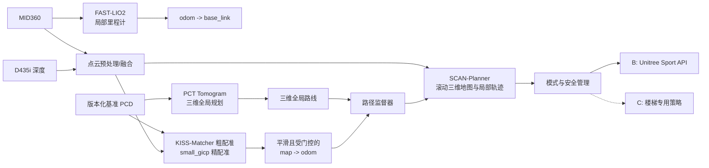

# Go2 三维导航与避障升级设计

日期：2026-08-10
状态：已确认，待拆分实施计划

## 1. 背景

当前系统使用 MID360、FAST-LIO2、PCD 全局定位和 Nav2。导航链路把三维点云压成二维激光扫描，并依赖静态二维地图、NavFn 和 DWB，因此存在以下瓶颈：

- 台阶、坑洼、坡面、低矮障碍和悬空障碍在二维投影中容易丢失或被错误表达；
- 全局地图不能反映实时障碍，全局路径也不能表达楼层、坡道和楼梯等三维连接关系；
- 全局路径与局部避障能力较弱，重规划周期长；
- 当前全局 ICP 定位频率低，校正跳变会传导到规划与控制；
- 后续自主上下规则楼梯需要三维路线、地形判断和独立运动模式，二维 Nav2 链路不适合作为长期基础。

硬件范围固定为 Unitree Go2 EDU、Jetson Orin NX 16 GB、MID360 和 D435i。当前开发与实机验证使用 Ubuntu 20.04 + ROS 2 Foxy；B 阶段稳定后再集中迁移到 Ubuntu 22.04 + ROS 2 Humble。

## 2. 目标与边界

### 2.1 B 阶段目标

在不改变 Go2 底层步态控制的前提下，完成：

- 坡道、常规门槛和小台阶的可通行性判断；
- 坑、负障碍、低矮障碍和悬空障碍的检测与绕行；
- 三维全局路径与实时三维局部避障；
- 定位丢失、传感器过期、路径失效或姿态异常时的确定性停车；
- 在 Foxy 和现有 Jetson 上完成 rosbag、影子模式、低速闭环和实景验收。

### 2.2 C 阶段目标

在 B 的地图、定位、全局规划、局部感知和安全框架上增加规则楼梯自主通行：

- 楼梯入口识别与对齐；
- 普通导航和楼梯专用运动策略之间的模式切换；
- 上下楼过程中的姿态、接触和失败保护；
- 楼梯出口定位恢复与路线续接。

C 不在本轮实现范围内。Go2 EDU 的低层控制权限、固件接口和可用策略需要在进入 C 前单独验证，不能仅根据 EDU 型号假定接口一定满足要求。

### 2.3 非目标

- 不在当前阶段同时维护 Foxy/Humble 两套运行系统；
- 不让机器人自动把行人、车辆或临时家具写入永久地图；
- 不在 B 阶段开发楼梯强化学习策略；
- 不为未来发行版差异提前建设通用兼容框架；
- 不要求 Nav2 保留在新运行链路中。

## 3. 方案选择

比较过三类路线：

1. 在 Nav2 上叠加 nvblox/elevation map。改动相对小，但全局规划仍主要是二维语义，难以自然推广到楼梯。
2. 采用 PCT Planner 做多层三维全局规划，SCAN-Planner 做实时三维局部规划，并补齐全局定位。组件边界清晰，B 到 C 的复用率最高。
3. 直接采用研究型端到端探索/规划系统。集成风险和硬件迁移成本更高，且通常缺少 Go2 实机可复用的完整链路。

选择第 2 类路线。Elevation Mapping CuPy 作为后备增强项，仅当 SCAN 的地形表达无法满足 B 阶段验收时再引入，避免一开始维护两套复杂局部地图。

## 4. 总体架构



核心原则是将职责拆开：FAST-LIO2 负责连续局部运动，配准链负责全局坐标，PCT 负责静态/多层全局路线，SCAN 负责实时局部环境和避障，独立安全管理器保留最终停车权。

## 5. 地图与坐标体系

### 5.1 四类地图产品

系统不维护一个同时承担所有职责的“万能地图”，而是从同一基准地图生成四类产品：

| 产品 | 更新方式 | 用途 |
|---|---|---|
| 版本化基准 PCD | 建图后受控发布 | 全局几何基准、派生数据来源 |
| 定位子图与索引 | 随地图版本离线生成 | 冷启动、重定位和局部精配准 |
| PCT Tomogram | 随地图版本离线生成 | 多层/三维全局规划 |
| SCAN 滚动三维地图 | 运行中持续更新 | 实时障碍、局部规划和避障 |

永久地图更新采用“发现—记录—人工/离线确认—生成新版本—回归—激活”的流程。运行时局部障碍只进入滚动地图；只有确认的持续结构变化才进入下一版基准 PCD。

### 5.2 坐标系

保持标准 TF 链：

```text
map -> odom -> base_link -> sensor frames
```

- FAST-LIO2 连续发布 `odom -> base_link`，全局校正不得重置局部里程计；
- 全局定位模块只管理 `map -> odom`；
- 所有规划输入带时间戳和明确 frame，禁止用静态复制的当前位姿替代 TF 查询；
- MID360 与 D435i 必须完成外参和时间同步验收后才允许融合。

## 6. 全局定位

### 6.1 定位链路

1. 静止或低速聚合当前点云；
2. 小场景或已有先验位姿时，直接在候选子图上运行 KISS-Matcher；
3. 大地图/多楼层时，先用地点检索缩小候选范围，再运行 KISS-Matcher；
4. 使用 small_gicp 做精配准并计算残差、重叠率和位姿一致性；
5. 通过时间、速度、位姿跳变量和置信度门控后，平滑更新 `map -> odom`；
6. 运行中由 small_gicp 低频跟踪和校正，FAST-LIO2 保持高频局部连续性。

KISS-Matcher 和 small_gicp 都属于配准算法，但职责不同：前者用于较大初始误差下的全局/粗配准，后者用于已有较好初值后的高精度对齐与持续校正。地点检索不是当前小地图的必需项，只在候选子图数量增长后加入。

### 6.2 定位状态

定位对外暴露最小状态：`UNINITIALIZED`、`LOCALIZING`、`TRACKING`、`DEGRADED`、`LOST`，并包含置信度、地图版本、最近成功时间和拒绝原因。

- 只有 `TRACKING` 且置信度达标时允许自主运动；
- 单次大跳变不得直接更新 TF，应触发复核或重定位；
- `DEGRADED` 限速并准备停车，`LOST` 立即停车；
- 切换地图版本时必须使旧索引、Tomogram 和缓存失效，防止跨版本混用。

## 7. 全局与局部规划

### 7.1 PCT 全局规划

PCT Planner 从基准 PCD 生成包含地面和顶部约束的 Tomogram，在以下事件发生时规划或重规划：

- 收到新目标；
- 地图版本变化；
- 全局位姿发生经确认的大幅校正；
- 路径监督器判定当前路线长时间不可通行；
- 当前路径偏离或失效。

PCT 输出带高度和姿态约束的全局路线。B 阶段把楼梯连接标记为禁止通行；C 阶段才允许选择满足规则的楼梯连接。

### 7.2 路径监督器

路径监督器是一个轻量协调层，不再实现规划算法。它负责：

- 验证全局路线与当前地图版本、定位状态是否一致；
- 从全局路线选取 SCAN 的局部目标/初始路径；
- 识别持续阻塞、偏航、进度停滞和路线失效；
- 请求 PCT 重规划或让模式管理器安全停车。

### 7.3 SCAN 局部规划

SCAN 维护机器人周围的三维滚动占据表达，接收 PCT 路线作为外部引导路径，并以 MID360 为主、D435i 近场深度为补充生成实时局部轨迹。D435i 数据只有在时间、外参、深度范围和新鲜度检查通过后才参与融合；失效时系统退化为 MID360 单传感器模式并降低能力边界。

SCAN 的机器人包络必须覆盖 Go2 身体、摆腿空间和安全余量。B 阶段重点验证坡面、坑边、低矮物体、桌面/横梁等上下双向空间约束，而不是只验证平面绕障。

## 8. 控制、模式与安全

### 8.1 模式管理

B 阶段状态机只实现：

```text
IDLE -> NORMAL_NAV <-> REPLAN -> SAFE_STOP
```

C 阶段在同一状态机中增加：

```text
STAIR_ALIGN -> STAIR_TRAVERSE -> EXIT_VERIFY
```

普通导航使用 Unitree Sport API 速度控制。楼梯策略未来通过模式管理器接入，不能与普通速度控制同时获得控制权。

### 8.2 独立安全监督

安全监督器独立于 PCT 和 SCAN，拥有最终停车权。以下条件至少触发限速、停车或锁止：

- MID360/里程计/局部规划输出超时；
- 全局定位丢失、置信度过低或未经确认的位姿跳变；
- 最近障碍进入硬安全包络；
- 机器人俯仰/横滚、速度或控制指令超过约束；
- 路径无进展且重规划失败；
- Unitree 控制链路、看门狗或急停异常；
- C 阶段的关节、接触或策略健康检查失败。

安全停止必须绕过规划器排队，直接向唯一运动执行端发送零速/停止并由看门狗保持。

## 9. ROS 2 接口与 Foxy 优先策略

当前只维护 Foxy 的构建、launch 和实机部署。减少未来迁移量的措施限定为：

- 优先使用标准 ROS 2 消息、TF2、C++17、ament 和 colcon；
- 算法核心与 ROS 节点包装保持自然边界，不建设通用插件框架；
- 话题名、frame、参数和状态枚举形成稳定契约，参数集中在 YAML；
- 固定 PCT、SCAN、KISS-Matcher、small_gicp 等上游 commit，并保存必要补丁；
- 保存代表性 rosbag、地图包和最小接口回归测试；
- 仅在真实发现 Foxy/Humble API 差异时添加小范围条件编译。

不维护双发行版 launch，不要求每次提交都在 Humble 构建，不搭建 Foxy/Humble 跨发行版运行链路。B 阶段验收后冻结接口，再一次性迁移 JetPack/Ubuntu/ROS 2，并用相同 rosbag 和场景回归。

## 10. 验证与验收

按风险由低到高推进：

1. 离线 rosbag：时间戳、TF、点云、定位、PCT 和 SCAN 可重复运行；
2. 全局定位：不同起点/朝向冷启动、遮挡、短时退化和恢复；
3. PCT：跨坡道、多层连接、净空约束和不可达目标；
4. SCAN 影子模式：只记录规划轨迹和停车判断，不控制机器人；
5. B 低速闭环：软质障碍和安全绳环境中逐项验证；
6. B 实景验收：组合路线和动态障碍；
7. Humble 集中迁移：同一数据集与场景回归；
8. C：仿真、低矮训练楼梯、安全吊具、单向上楼、单向下楼，再到完整任务。

B 阶段最低验收指标：

- 代表性起点冷启动定位成功率不低于 95%；
- 稳定跟踪时全局位置误差不高于 0.20 m、航向误差不高于 5°；
- 已定义测试集中碰撞次数为 0，坑边和悬空障碍不得被二维化误放行；
- 传感器或定位故障进入安全停止的端到端延迟不高于 200 ms；
- 动态阻塞解除后可继续任务，持续阻塞时能重规划或确定性停车；
- 同一 rosbag 重放产生一致的状态转换和可解释的规划结果。

具体阈值在首次数据采集后允许基于测量收紧，但不得在没有记录原因的情况下放宽安全边界。

## 11. 实施阶段

1. 固化消息、TF、地图包和数据回放契约；
2. 在 Foxy 上接入 KISS-Matcher + small_gicp，替换现有跳变式 ICP 校正；
3. 适配 PCT 的离线建图产物和在线全局规划接口；
4. 适配 SCAN 的 Foxy 节点、外部全局路线和 Go2 包络；
5. 增加路径监督器、模式管理和独立安全监督；
6. 完成 B 的离线、影子、低速和实景验收；
7. 冻结接口并集中迁移 Humble；
8. 单独设计和实施 C 的楼梯感知与运动策略。

每一步都必须能独立回退到上一阶段，不在同一次实机试验中同时首次启用定位、规划和运动控制改动。

## 12. 主要风险与处置

| 风险 | 处置 |
|---|---|
| PCT 上游以 ROS 1 Noetic 工作流为主 | 复用算法与数据结构，编写最薄 ROS 2 Foxy 适配；先离线验证再在线化 |
| SCAN ROS 2 分支主要面向 Humble，成熟度有限 | 固定 commit，先 rosbag/影子模式，补齐 Foxy API 差异和 watchdog |
| PCT 为 GPLv2，未来商业分发存在许可约束 | 当前研究原型可评估；产品化前完成许可审查或替换实现 |
| Jetson 资源竞争导致延迟 | 分阶段测量 GPU/CPU/内存与端到端时延，降低地图范围/分辨率而非盲目叠加算法 |
| D435i 室外/强光或近距离深度退化 | MID360 为主传感器，深度数据带质量门控，退化时限速 |
| 动态局部地图与静态全局路线冲突 | 路径监督器设置阻塞持续时间和重规划条件，不把瞬时障碍写回全局图 |
| B 到 C 被误认为只需调参 | C 独立验收低层接口、楼梯策略、接触安全和吊具测试，不提前承诺复用运动控制 |

## 13. 上游项目

- [SCAN-Planner](https://github.com/wuyi2121/SCAN-Planner)：实时三维局部规划与滚动占据表达；
- [PCT Planner](https://github.com/byangw/PCT_planner)：基于点云 Tomogram 的三维/多层全局规划；
- [KISS-Matcher](https://github.com/MIT-SPARK/KISS-Matcher)：鲁棒点云粗配准；
- [small_gicp](https://github.com/koide3/small_gicp)：高性能精配准与跟踪；
- [Elevation Mapping CuPy](https://github.com/leggedrobotics/elevation_mapping_cupy)：必要时补充地形/可通行性表达；
- [FAST_LIO_SLAM_ros2](https://github.com/rohrschacht/FAST_LIO_SLAM_ros2)：长距离建图发生明显漂移时的可选回环建图参考；
- [Unitree RL Lab](https://github.com/unitreerobotics/unitree_rl_lab)：C 阶段 Go2 楼梯策略训练与仿真的候选基础。

上游项目只作为选定职责的实现基础，不直接假定其示例 launch、坐标系、消息接口或实机安全逻辑可原样用于本系统。
